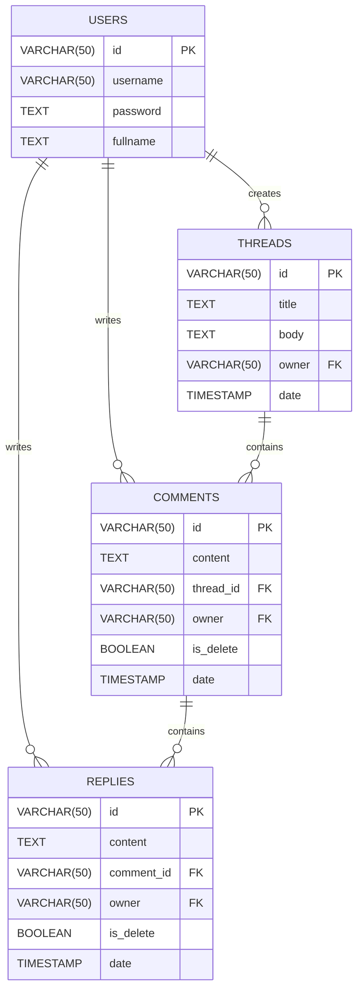

# ⛩️ Forum API - Shogi Game Indonesia 🀪 (Dicoding Case Study) 

   

Implementasi **RESTful API** untuk aplikasi forum diskusi komunitas game Shogi. Proyek ini dibangun sebagai bagian dari submisi *Backend Expert Course* di Dicoding, menerapkan prinsip **Clean Architecture**, **TDD (Test-Driven Development)**, dan keamanan autentikasi modern.

Link: https://www.tame-files-change-sleepily.st.a.dcdg.xyz

## 📋 Daftar Isi
- [Fitur Utama](#-fitur-utama)
- [Arsitektur & Struktur Proyek](#-arsitektur--struktur-proyek)
- [Teknologi](#-teknologi)
- [Skema Database](#-skema-database)
- [Instalasi & Konfigurasi](#-instalasi--konfigurasi)
- [Dokumentasi API](#-dokumentasi-api)
- [Pengujian (Testing)](#-pengujian-testing)

---

## 🚀 Fitur Utama

1.  **Autentikasi Aman**: Menggunakan JWT (Access & Refresh Token) dengan enkripsi password Bcrypt.
2.  **Thread Diskusi**: Membuat dan melihat diskusi.
3.  **Komentar & Balasan**: Mendukung diskusi bertingkat (Nested Comments).
4.  **Soft Delete**: Komentar/balasan yang dihapus tidak hilang dari DB, namun kontennya disensor.
5.  **Robust Error Handling**: Penanganan error terpusat sesuai standar HTTP Code.

---

## 🏰 Arsitektur & Struktur Proyek

Proyek ini menerapkan **Clean Architecture** untuk memisahkan *business logic* dari *framework* dan *tools*.

```text
src/
├── Applications/       # Use Cases (Business Logic orchestration)
├── Commons/            # Error classes, Constants
├── Domains/            # Entities & Repository Interfaces (Enterprise Logic)
├── Infastructures/     # Database implementation, Security tools, HTTP Server
│   ├── Container/      # Dependency Injection (Awilix/Instances)
│   ├── Database/       # Postgres implementation
│   ├── Http/           # Hapi Server setup
│   ├── Repository/     # Concrete Repositories
│   └── Security/       # Concrete Encryption/Token managers
├── Interfaces/         # Hapi Routes & Handlers
└── app.js              # Entry point

```

## 💻 Teknologi

* **Runtime**: Node.js
* **Framework**: Hapi
* **Database**: PostgreSQL
* **Autentikasi**: @hapi/jwt (JWT)
* **Password Hashing**: bcrypt
* **Migrasi DB**: node-pg-migrate
* **Testing**: Jest
* **Container**: instances-container

---

## 💾 Skema Database

Aplikasi ini menggunakan **PostgreSQL**. Berikut adalah desain relasi antar tabel (ERD) dan detail strukturnya.

### Entity Relationship Diagram (ERD)



## 🛠 Instalasi & Konfigurasi

Ikuti langkah-langkah berikut untuk menjalankan server API di lingkungan lokal (Local Development).

### 1. Prasyarat (Prerequisites)

Pastikan perangkat Anda telah terinstal:

* **[Node.js](https://nodejs.org/)** (Disarankan versi LTS, v22+)
* **[PostgreSQL](https://www.postgresql.org/download/)** (Database)
* **[Git](https://git-scm.com/)** (Version Control)

### 2. Instalasi Project

1.  **Clone repositori ini:**
    ```bash
    git clone https://github.com/ALDY-Tech/Starter-Project-Forum-API
    cd Starter-Project-Forum-API
    ```

2.  **Install Dependencies:**
    Jalankan perintah berikut untuk mengunduh seluruh library yang dibutuhkan (Hapi, node-postgres, Jest, dll):
    ```bash
    npm install
    ```

### 3. Konfigurasi Environment (.env)

Proyek ini menggunakan paket `dotenv`. Anda perlu membuat file konfigurasi lingkungan agar server bisa berjalan.

1.  Buat file baru bernama `.env` di root folder proyek.
2.  Salin konfigurasi berikut dan sesuaikan dengan user/password PostgreSQL lokal Anda:

    ```env
    # HTTP SERVER
    HOST=localhost
    PORT=5000

    # POSTGRES (DEVELOPMENT)
    PGUSER=postgres
    PGHOST=localhost
    PGPASSWORD=password_postgres_anda
    PGDATABASE=forumapi
    PGPORT=5432

    # POSTGRES (TESTING - Wajib untuk Automation Test)
    PGUSER_TEST=postgres
    PGHOST_TEST=localhost
    PGPASSWORD_TEST=password_postgres_anda
    PGDATABASE_TEST=forumapi_test
    PGPORT_TEST=5432

    # TOKENIZE (JWT)
    # Gunakan string acak yang panjang dan unik
    ACCESS_TOKEN_KEY=rahasia-access-token
    REFRESH_TOKEN_KEY=rahasia-refresh-token
    ACCESS_TOKEN_AGE=3000
    ```

### 4. Setup Database & Migrasi

Proyek ini menggunakan `node-pg-migrate` untuk manajemen struktur database.

1.  **Buat Database:**
    Pastikan service PostgreSQL sudah berjalan, lalu buat dua database (untuk development dan testing):
    
    *Via Terminal/SQL Shell:*
    ```sql
    CREATE DATABASE forumapi;
    CREATE DATABASE forumapi_test;
    ```
    
    *Atau sudah menyiapkan script di package.json:*
    ```bash
    npm run db:create
    npm run db:create:test
    ```

2.  **Jalankan Migrasi:**
    Terapkan struktur tabel ke database development:
    ```bash
    npm run migrate up
    npm run migrate:test up
    ```

### 5. Menjalankan Aplikasi

* **Mode Development (Nodemon):**
    Server akan restart otomatis setiap ada perubahan kode.
    ```bash
    npm run start:dev
    ```

* **Mode Production:**
    ```bash
    npm start
    ```

Jika berhasil, Anda akan melihat pesan di terminal:
> Server berjalan pada http://localhost:5000

### 6. Menjalankan Pengujian (Testing)

Proyek ini menerapkan *Automation Testing* (Unit, Integration, & Endpoint Test) menggunakan **Jest**.

Untuk menjalankan seluruh test suite:
```bash
npm run test
```
---
## 📖 Dokumentasi API

Berikut adalah daftar endpoint yang tersedia. Semua response dikembalikan dalam format JSON.

**Base URL:** `http://localhost:5000`

### 1. Autentikasi (Authentications)

Mengelola login, logout, dan refresh token.

| Method | Endpoint | Deskripsi | Auth |
| :--- | :--- | :--- | :---: |
| `POST` | `/authentications` | Login pengguna (mendapatkan Token) | ❌ |
| `PUT` | `/authentications` | Memperbarui Access Token | ❌ |
| `DELETE` | `/authentications` | Logout (Hapus Refresh Token) | ❌ |

#### **Login User**
* **URL:** `/authentications` (POST)
* **Body:**
    ```json
    {
      "username": "dicoding",
      "password": "secret_password"
    }
    ```
* **Response (201 Created):**
    ```json
    {
      "status": "success",
      "data": {
        "accessToken": "eyJhbGciOiJIUzI1NiIsInR5c...",
        "refreshToken": "eyJhbGciOiJIUzI1NiIsInR5c..."
      }
    }
    ```

---

### 2. Pengguna (Users)

Registrasi pengguna baru.

| Method | Endpoint | Deskripsi | Auth |
| :--- | :--- | :--- | :---: |
| `POST` | `/users` | Mendaftarkan pengguna baru | ❌ |

#### **Register User**
* **URL:** `/users` (POST)
* **Body:**
    ```json
    {
      "username": "dicoding",
      "password": "secret_password",
      "fullname": "Dicoding Indonesia"
    }
    ```
* **Response (201 Created):**
    ```json
    {
      "status": "success",
      "data": {
        "addedUser": {
          "id": "user-123",
          "username": "dicoding",
          "fullname": "Dicoding Indonesia"
        }
      }
    }
    ```

---

### 3. Threads (Diskusi)

Mengelola diskusi utama.

| Method | Endpoint | Deskripsi | Auth |
| :--- | :--- | :--- | :---: |
| `POST` | `/threads` | Membuat thread baru | ✅ |
| `GET` | `/threads/{threadId}` | Melihat detail thread, komentar, & balasan | ❌ |

#### **Create Thread**
* **Header:** `Authorization: Bearer <ACCESS_TOKEN>`
* **Body:**
    ```json
    {
      "title": "Judul Diskusi",
      "body": "Isi materi diskusi..."
    }
    ```
* **Response (201 Created):**
    ```json
    {
      "status": "success",
      "data": {
        "addedThread": {
          "id": "thread-123",
          "title": "Judul Diskusi",
          "owner": "user-123"
        }
      }
    }
    ```

#### **Get Detail Thread**
* **URL:** `/threads/{threadId}` (GET)
* **Response (200 OK):**
    ```json
    {
      "status": "success",
      "data": {
        "thread": {
          "id": "thread-123",
          "title": "Judul Diskusi",
          "body": "Isi materi diskusi...",
          "date": "2023-11-20T04:20:01.000Z",
          "username": "dicoding",
          "comments": [
            {
              "id": "comment-123",
              "username": "johndoe",
              "date": "2023-11-20T04:22:01.000Z",
              "content": "Komentar yang menarik!",
              "replies": [
                  {
                      "id": "reply-123",
                      "content": "**balasan telah dihapus**",
                      "date": "...",
                      "username": "dicoding"
                  }
              ]
            }
          ]
        }
      }
    }
    ```

---

### 4. Komentar & Balasan (Comments & Replies)

Mengelola interaksi di dalam thread.

| Resource | Method | Endpoint | Body | Auth |
| :--- | :--- | :--- | :--- | :---: |
| **Comment** | `POST` | `/threads/{threadId}/comments` | `{ "content": "..." }` | ✅ |
| **Comment** | `DELETE` | `/threads/{threadId}/comments/{commentId}` | - | ✅ |
| **Reply** | `POST` | `/threads/{threadId}/comments/{commentId}/replies` | `{ "content": "..." }` | ✅ |
| **Reply** | `DELETE` | `/threads/{threadId}/comments/{commentId}/replies/{replyId}` | - | ✅ |

#### **Catatan Soft Delete:**
Jika Komentar atau Balasan dihapus, data di database **tidak hilang**, namun konten saat di-request (GET Thread) akan berubah menjadi:
* Komentar: `**komentar telah dihapus**`
* Balasan: `**balasan telah dihapus**`

---

## 🧪 Pengujian (Testing)

Proyek ini menerapkan standar pengujian yang ketat menggunakan **Jest** untuk menjamin reliabilitas aplikasi. Pengujian mencakup tiga level: **Unit Test**, **Integration Test**, dan **Functional (E2E) Test**.

### 1. Prasyarat Pengujian

Sebelum menjalankan tes, pastikan hal-hal berikut sudah terpenuhi:

1.  **Database Test Tersedia:**
    Pastikan database khusus testing (biasanya bernama `forumapi_test`) sudah dibuat di PostgreSQL lokal Anda.
    ```sql
    CREATE DATABASE forumapi_test;
    ```

2.  **Environment Variable Test:**
    Pastikan file `.env` Anda memiliki konfigurasi database testing yang benar. Jest akan menggunakan variabel ini untuk koneksi.
    ```env
    PGDATABASE_TEST=forumapi_test
    ```

3.  **Migrasi Database Test:**
    Struktur tabel pada database test harus sinkron dengan database utama.
    ```bash
    npm run migrate:test
    # Atau jika menggunakan script migrate biasa dengan env test
    npm run migrate -- -d forumapi_test
    ```

### 2. Menjalankan Tes

Berikut adalah perintah-perintah yang dapat digunakan:

#### **A. Menjalankan Seluruh Tes**
Untuk menjalankan semua suite (Unit, Integration, & Endpoint) sekaligus:

```bash
npm run test
```

#### **B. Menjalankan Tes dengan Coverage Report**
Untuk melihat seberapa banyak baris kode yang ter-cover oleh pengujian:
```bash
npm run test -- --coverage
```

#### **C. Menjalankan Watch Mode**
Untuk melihat apa semua file sudah dicoverage semua
```bash
npm run test:watch
```